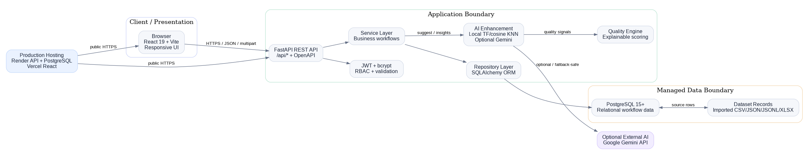

# AI Dataset Labeling Marketplace

**AI-assisted, human-in-the-loop platform for importing datasets, distributing annotation work, reviewing quality, and exporting trusted labeled data.**

## 2. Live Demo link + Video Demo link

- **Live Demo:** `PENDING_USER_DEPLOYMENT` — the capstone requires a public URL; no fake URL is included.
- **Video Demo:** `PENDING_USER_RECORDING` — record the final 2–4 minute walkthrough after the live deployment is verified.
- **API Docs:** once deployed, open `<BACKEND_URL>/docs`.

## 3. Overview

AI Dataset Labeling Marketplace manages the complete annotation lifecycle for structured text datasets. Dataset owners create projects, upload bounded CSV/JSON/JSONL/XLSX source data, configure labels, create tasks, assign annotators, monitor progress, review annotations and export approved results. Annotators work in a dedicated workspace with an explainable AI suggestion assistant, while administrators manage accounts and platform-level operations. AI assists rather than replaces the human decision-maker.

## 4. Architecture Diagram



Editable source: `docs/diagrams/Architecture_Diagram_v2.dot`.

## 5. Tech Stack

| Layer | Technology |
|---|---|
| Frontend | React 19, Vite, JavaScript, responsive CSS |
| API | Python 3.11+, FastAPI, Uvicorn |
| Validation | Pydantic v2 |
| ORM / Data access | SQLAlchemy 2 |
| Database | PostgreSQL 15+ |
| Authentication | JWT + bcrypt |
| AI | Offline TF/cosine nearest-neighbour engine + optional Google Gemini |
| Quality | Deterministic explainable quality engine |
| Testing | Pytest + coverage |
| Linting | Ruff + ESLint |
| API contract | FastAPI OpenAPI / Swagger |
| CI/CD | GitHub Actions |
| Hosting | Render backend + managed PostgreSQL; Vercel frontend |
| Optional local infrastructure | Docker Compose |

## 6. Features

### Dataset Owner
- Create, update and delete owned datasets.
- Upload CSV, JSON, JSONL or XLSX files with validation and bounded limits.
- Store imported source records and upload provenance in PostgreSQL.
- Create labeling jobs and configure annotation type and allowed labels.
- Convert uploaded source records into annotation tasks without silently collapsing duplicate source rows.
- Assign tasks/jobs to annotators.
- Monitor workflow and quality analytics.
- Review, approve, reject or request revision.
- Export approved labeled records with AI provenance.

### Annotator
- View only assigned work.
- Open the annotation workspace.
- Request AI suggestions for the assigned task.
- Accept or change AI suggestions.
- Submit labels, confidence and notes.
- Revise or withdraw non-approved annotations where workflow rules allow.

### Administrator
- Manage users, roles and account activation.
- Monitor platform-wide activity.
- Perform administrative corrections.

### AI enhancement
- Local deterministic similarity classifier for zero-cost/offline operation.
- Optional Gemini provider with automatic fallback to the local engine.
- Candidate labels from job configuration and previously observed labels.
- Confidence, alternatives and rationale.
- Explainable quality scoring and flags.
- Job-level AI coverage, agreement, duplicates and recommendations.
- AI never performs final approval.

## 7. Screenshots of key screens

The production evidence package should contain screenshots of these final hosted screens:

1. Owner dashboard
2. Dataset creation + upload screen
3. Labeling job configuration
4. Task import/assignment screen
5. Annotator AI workspace
6. Quality review screen
7. Analytics screen
8. Administrator user management
9. Export screen

Screenshots must be captured from the final deployed build before Review-II/Review-III; no synthetic screenshots are claimed as live evidence.

## 8. Getting Started: prerequisites, clone, install, env vars, run locally

### Backend

Requirements: Python 3.11+ and PostgreSQL 15+ for the production-equivalent setup. SQLite is supported by the automated test suite.

```powershell
Copy-Item .env.example .env
py -m venv .venv
.\.venv\Scripts\Activate.ps1
python -m pip install -r requirements-dev.txt
python -m uvicorn backend.app.main:app --reload --port 8000
```

Open `http://127.0.0.1:8000/docs`.

### Frontend

```powershell
Set-Location frontend
npm ci
Copy-Item .env.example .env
npm run dev
```

Open `http://localhost:5173`.

### Docker

```powershell
docker compose up --build
```

### Existing PostgreSQL database

Apply `database/migrations/003_dataset_upload_and_job_labels.sql` before using the upload/label-taxonomy enhancement on an existing Review-II database.

## 9. Environment Variables table

| Variable | Description | Required |
|---|---|---:|
| `DATABASE_URL` | PostgreSQL SQLAlchemy URL in production | Yes |
| `SECRET_KEY` | 32+ character random JWT signing secret | Yes |
| `ALGORITHM` | JWT signing algorithm, normally HS256 | No |
| `ACCESS_TOKEN_EXPIRE_MINUTES` | JWT lifetime | No |
| `CORS_ORIGINS` | Comma-separated deployed frontend origins | Yes |
| `ENVIRONMENT` | `development`, `ci` or `production` | No |
| `LOG_LEVEL` | INFO/WARNING/etc. | No |
| `RATE_LIMIT_ENABLED` | Enable request throttling | No |
| `RATE_LIMIT_REQUESTS` | Requests per window | No |
| `RATE_LIMIT_WINDOW_SECONDS` | Rate-limit window | No |
| `SECURITY_HEADERS_ENABLED` | Browser security headers | No |
| `TRUST_PROXY_HEADERS` | Trust hosting proxy headers | No |
| `HSTS_MAX_AGE_SECONDS` | Production HSTS lifetime | No |
| `AI_PROVIDER` | `local`, `auto` or `gemini` | No |
| `GEMINI_API_KEY` | Optional Google Gemini credential | No |
| `GEMINI_MODEL` | Gemini model identifier | No |
| `AI_MIN_CONFIDENCE` | Quality threshold for AI confidence | No |
| `VITE_API_URL` | Frontend API base URL | Yes for hosted frontend |

## 10. API Documentation link

- Local Swagger UI: `http://127.0.0.1:8000/docs`
- Local OpenAPI JSON: `http://127.0.0.1:8000/openapi.json`
- Committed contract: `docs/openapi.json`
- Review artifact: `docs/diagrams/API_Contract_v2.pdf`

## 11. Running Tests

Backend:

```powershell
python -m ruff check backend tests
python -m ruff format --check backend tests
python -m pytest -q
```

Frontend:

```powershell
Set-Location frontend
npm ci
npm run lint
npm run build
```

The final local backend verification performed for this source tree reached **214 passing tests** with no failing tests; the service-layer coverage target is exceeded in the project configuration. The CI workflow must be the final authority on the clean repository state.

## 12. Deployment

- **Backend:** Render web service using `render.yaml`.
- **Database:** Render managed PostgreSQL.
- **Frontend:** Vercel using the committed frontend configuration.
- **CI:** `.github/workflows/backend.yml` and `.github/workflows/frontend.yml` run dependency installation, lint/build/test gates and only trigger deployment after successful main-branch checks.
- **Secrets:** GitHub Actions secrets and hosting environment variables only; no production credentials are stored in source.

The public URLs, hosting secrets, and deployment smoke test must be supplied/verified by the project owner. This repository deliberately does not fabricate those values.

## 13. Folder Structure

```text
backend/app/
  api/             REST routers — thin controllers
  core/            configuration, security, errors, middleware
  models/          SQLAlchemy ORM entities
  repositories/    database access
  schemas/         Pydantic request/response models
  services/        business logic and AI orchestration
frontend/src/
  components/      reusable UI/workflow components
  pages/           role-aware screens
  services/        API clients
  utils/           presentation helpers
database/
  schema.sql
  migrations/
docs/
  diagrams/
tests/
.github/workflows/
```

## 14. Future Enhancements

- Active-learning queues driven by uncertainty.
- Multi-annotator agreement metrics such as Cohen's/Fleiss' kappa where the workflow supports them.
- Embedding-based semantic retrieval for large annotation histories.
- Image/audio annotation formats.
- Large-scale object storage and asynchronous import workers.
- Redis-backed distributed rate limiting for multi-instance production.

## 15. License

MIT License. See `LICENSE`.

## 16. Author / Contact

**Sivanesh K**

Project: AI Dataset Labeling Marketplace

GitHub: `https://github.com/sivaneshk23`
